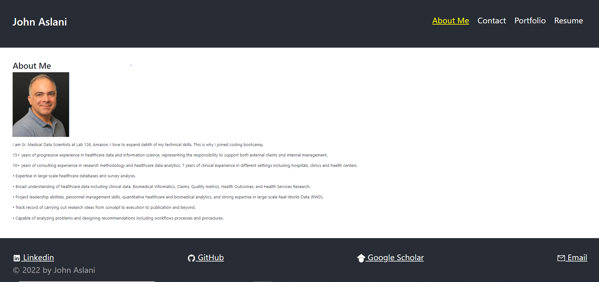

# react-portfolio

## react-portfolio is a practice app to create a professional portfolio page using react library of JavaScript

## Contributions

Made by John Aslani

## License: MIT

This program licensed under [MIT](https://img.shields.io/badge/license-MIT-blue)

## Screenshot

## Link to deployed application

https://johnaslani.github.io/react-portfolio-hw/

## Questions

For further information see [my GitHub](https://github.com/johnaslani) or [Portfolio - react](https://github.com/johnaslani/react-portfolio-hw)

Should you have any questions, please reach me at [aslani.john@gmail.com](mailto:aslani.john@gmail.com)

